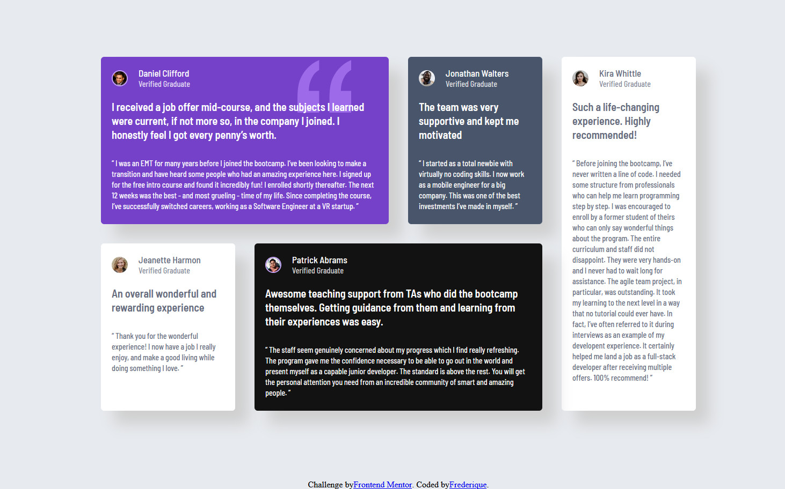

 🎯 Frontend Mentor - Défi "Testimonials Grid Section"

Bienvenue sur mon nouveau challenge Frontend Mentor !  
J’ai recréé une grille de témoignages conforme au design fourni (desktop et mobile).  
Ce projet m’a permis de progresser en CSS Grid, responsive design et positionnement d’éléments complexes.

 🖼️ Aperçu

Voici un aperçu visuel du projet terminé :  

 🚀 Le défi

- Reproduire fidèlement la grille de témoignages du design
- Utiliser CSS Grid pour la disposition
- Gérer des tailles d’écrans différentes (responsive mobile-first)
- Positionner une image de fond décorative dans un seul bloc (Daniel Clifford)
- Masquer l'image à certaines tailles d’écran, puis la faire réapparaître au bon breakpoint

 🔗 Liens utiles

- 💻 Code source : [À compléter sur GitHub]()
- 🌍 Site en ligne : [À compléter pour la version hébergée]()

 🛠️ Outils utilisés

- HTML5 
- CSS3
- CSS Grid + Flexbox
- clamp() pour des tailles adaptatives
- Media queries pour gérer la responsivité

 📚 Ce que j’ai appris

Ce projet m’a vraiment challengée sur plusieurs points :

- Mieux structurer une page avec "CSS Grid"
- Utiliser "media queries" pour adapter la disposition selon la largeur de l’écran
- Appliquer et masquer une "image en arrière-plan" selon le breakpoint
- Ajuster le "z-index", "position: relative" et "absolute" pour bien superposer les éléments
- Résoudre un problème où le texte dépassait le bloc sur mobile 

 🔄 À améliorer plus tard

- Ajouter des animations douces à l’apparition des blocs
- Tester sur plus de navigateurs pour vérifier le rendu

 📚 Ressources utiles

- [CSS Grid - Guide complet (CSS Tricks)](https://css-tricks.com/snippets/css/complete-guide-grid/)
- [MDN - clamp()](https://developer.mozilla.org/fr/docs/Web/CSS/clamp)
- [MDN - position et z-index](https://developer.mozilla.org/fr/docs/Web/CSS/position)

 👩‍💻 À propos de moi

Je m’appelle Frédérique et j’apprends le développement web étape par étape avec des projets pratiques.

- GitHub : [@oxford777](https://github.com/oxford777)
- Frontend Mentor : [@oxford777](https://www.frontendmentor.io/profile/oxford777)

 🙏 Merci

Merci à Frontend Mentor pour ce défi très formateur !  
Ça m’aide à mieux comprendre comment structurer une mise en page complexe tout en gardant une approche responsive. 😊
